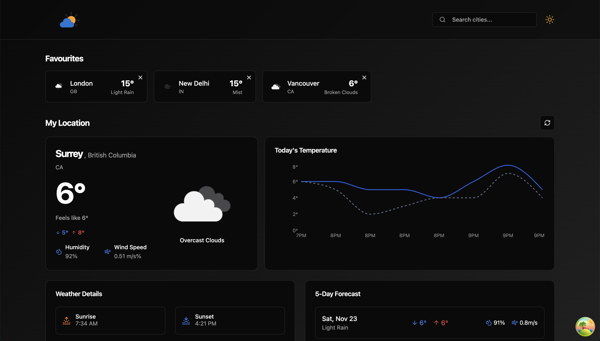
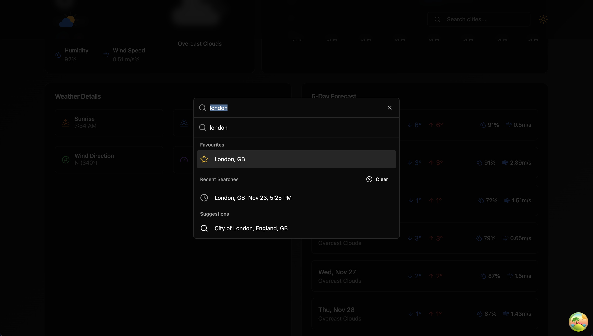
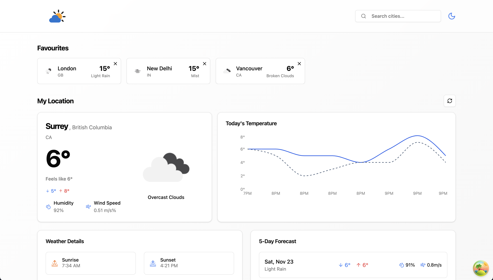
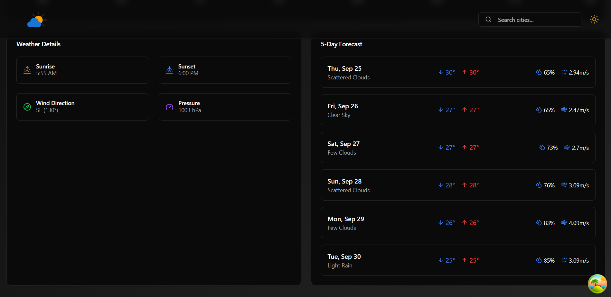
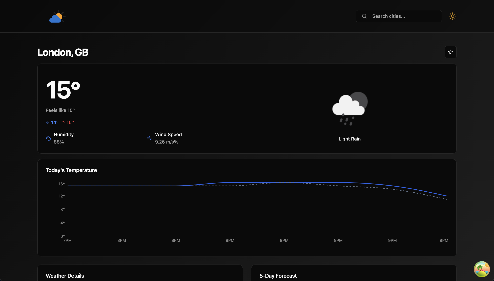

# 🌤️ Tanstack Shad Weather App

The Tanstack Shad Weather App combines a user-friendly interface with powerful features like detailed forecasts, city search, favorites, and interactive charts, all backed by a robust technology stack. TanStack Query ensures efficient API interactions, TypeScript guarantees reliability, React powers the dynamic frontend, shadcn and TailwindCSS deliver a polished UI, and Recharts provides insightful visualizations. This combination makes the app both functional and visually appealing, suitable for users seeking a modern weather tracking solution.

## Screenshot

Here is a screenshot of the project:

## 🚀 Features

- **🌞 Beautiful UI**: Toggle between light and dark modes for a tailored experience.
- **🌡️ Detailed Forecasts**: View weather forecasts for the next 12 hours, including temperature and "feels like" data.
- **⭐ Favorites**: Save and manage your favorite cities for quick access.
- **🔍 Search**: Find weather information for any city with ease.
- **📊 Charts**: Interactive temperature charts powered by Recharts.

---

## 🛠️ Technology Stack

- **[TanStack Query](https://tanstack.com/query/latest)**: Fetching APIs with refresh on focus and time interval support.
- **[TypeScript](https://www.typescriptlang.org/)**: Ensures type safety for robust development.
- **[React](https://reactjs.org/)**: Handles the dynamic and responsive frontend.
- **[shadcn](https://shadcn.dev/)** & **[TailwindCSS](https://tailwindcss.com/)**: For scalable and elegant styling.
- **[Recharts](https://recharts.org/)**: Displays interactive temperature charts.

---

## 📥 Installation

Follow these steps to set up the project locally:

1. Clone the repository:
   `git clone https://github.com/SARTHAKHAPPY/tanstack-shad-weather-app.git`
2. Navigate to project directory:
   `cd tanstack-shad-weather-app`
3. Install dependencies:
   `npm install`
4. Start the development server:
   `npm run dev`

## 🙏 Acknowledgements

A big thank you to the following for making this project possible:

- **[TanStack Query](https://tanstack.com/query)** for seamless API integration and efficient state management.
- **[shadcn.dev](https://shadcn.dev)** and **[TailwindCSS](https://tailwindcss.com)** for providing styling inspiration and tools.
- **[Recharts](https://recharts.org/)** for enabling intuitive and beautiful data visualization.
- The **open-source community** for their amazing tools, libraries, and resources that power modern web development.

#

